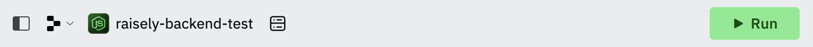

# Raisely API - Manage profiles and Donations

## Overview
---
A simplified version of the Raisely API for managing profiles and donations.

## Requirements
---
Before the application can be run ensure **Node.js** has been installed on your computer by running the following command in your terminal:
```
$ node -v
```
*Output example:*
```
$ v20.13.1
```

If **Node** is not installed on your computer you can follow the instructions outlined [here](https://nodejs.org/en/download/package-manager).

## Running the application locally
---
Follow the steps below to run the application locally.
1. Clone the repository by entering the following command in to your terminal:

```
$ git clone https://github.com/barbs89/raisely-backend-test.git
```
2. Install the required node packages:
```
$ npm install
```
3. Start the server
```
$ npm start
```
4. Visit `http://localhost:8080` in your browser.
```
[nodemon] 3.1.0
[nodemon] to restart at any time, enter `rs`
[nodemon] watching path(s): *.*
[nodemon] watching extensions: js,mjs,cjs,json
[nodemon] starting `node server/index.js`
Raisely example app listening at http://localhost:8080
...
```
### Testing
---
This application uses the [Jest](https://jestjs.io/docs/getting-started) testing framework. It contains three test files; `index.test.js`, `profiles.test.js` and `donations.test.js`. 

Each test serves a different purpose that contributes to the overall quality, maintainability, and scalability of the application.

To begin testing run the following command in your terminal:
```
$ npm test
```
To test specific files such as `index.test.js`, you can pass one positional argument:
```
$ npm test index.test.js 
```
*Output example:*
```
> raisely-backend-test@1.0.0 test
> jest tests/index.test.js --no-cache  --forceExit && jest tests/profiles.test.js --no-cache  --forceExit && jest tests/donations.test.js --no-cache  --forceExit index.test.js

  console.log
    Raisely example app listening at http://localhost:8080

      at Server.log (server/index.js:110:10)

 PASS  tests/index.test.js
  Routes
    GET /
      ✓ server is running on correct port (1 ms)
    GET /profiles
      ✓ should return profiles  (1034 ms)
    GET /profiles/:id
      ✓ should return a single profile  (5 ms)
    GET /profiles/:id/donations
      ✓ should return a single profile's donations (1007 ms)
    POST /profiles/:id/donations
      ✓ should create a new donation and respond with status 201 and the updated donations list (29 ms)
      ✓ should respond with status 400 if the donation is invalid (3 ms)
    POST /donations
      ✓ should create a new donation and respond with status 201 and the updated donations list (4 ms)
      ✓ should respond with status 400 if the donation is invalid (2 ms)

Test Suites: 1 passed, 1 total
Tests:       8 passed, 8 total
Snapshots:   0 total
Time:        2.392 s
Ran all test suites matching /tests\/index.test.js/i.
Force exiting Jest: Have you considered using `--detectOpenHandles` to detect async operations that kept running after all tests finished?

```
### Making POST requests
---
`POST` requests can be made in your terminal by running a [cURL](https://curl.se/docs/) command as shown in the example below.

Example `POST` Request to local environment:

```bash
$ curl -X POST http://localhost:8080/profiles/<profileId>/donations -H 'Content-Type: application/json' -d '{ "donorName": "Andrew Smith", "amount": 100, "profileId": "2ad19172-9683-407d-9732-8397d58ddcb2", "currency": "AUD"}'
```

After a successful request is submitted you will be able to see the donations made in the `/donations` end point.

Latest donations will be visible in the browser after the page is refreshed.

## Running the application online
---
The application has been uploaded to REPLIT and can be accessed using this link - [**@barbs89/raisely-backend-test**](https://replit.com/@barbs89/raisely-backend-test).

To start the server, click the green `RUN` button.



Once running, you can make curl requests in the `SHELL` tab, or
 you can use **REPLIT Dev url** and make requests in your terminal:
```
https://1a814ae3-193c-46d4-af50-278e8dce4d68-00-a91mzu0ipquc.janeway.replit.dev/
```

### Making POST requests
---
`POST` requests to the application in REPLIT can be made by replacing the localhost url with the dev url as shown in the example below.

Example `POST` Request to REPLIT Dev URL:
```bash
$ curl -X POST <full-REPLIT-Dev-URL-path>/profiles/<profileId>/donations -H 'Content-Type: application/json' -d '{ "donorName": "Andrew Smith", "amount": 100, "profileId": "2ad19172-9683-407d-9732-8397d58ddcb2", "currency": "AUD"}'
```
